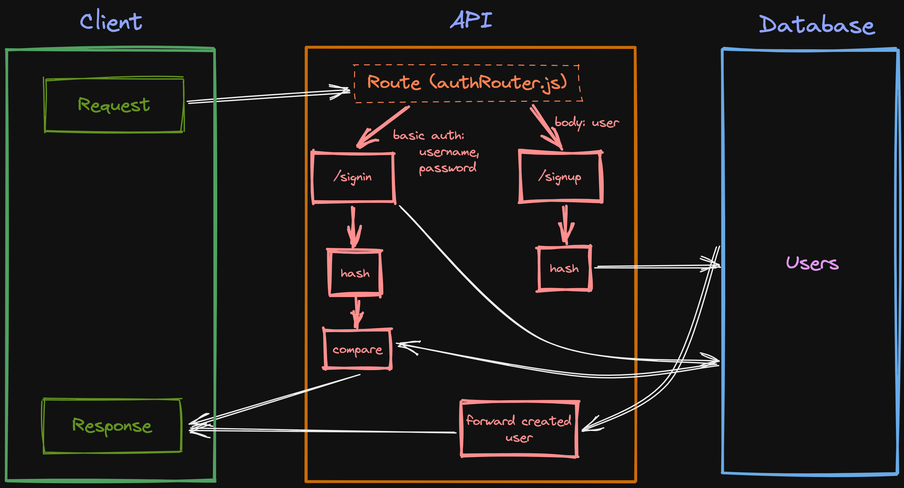

# Lab - Class 04

## Project: API Server

### Author: Julian Barker

### Problem Domain  

This repo builds an api server with routes for signout and signin, implemented with basic auth.

### Links and Resources

- [deployment](https://four01-basic-auth.onrender.com)

### Setup

#### `.env` requirements (where applicable)

- `PORT` - 3001
- `DATABASE_URL` - postgres://localhost:5432/\<database-name\>?sslmode=disable

#### How to initialize/run your application (where applicable)

- `npm start` (alias for `node index.js`)

#### Features / Routes

- GET : `/` - return "We're live!!!"
- POST : `/signup` - provide username and password in the body, and receive the username and hashed password from the database as a response
- POST : `/signin` - provide username and password as basic auth

#### Tests

- no tests written for this lab

#### UML

### Attributions
